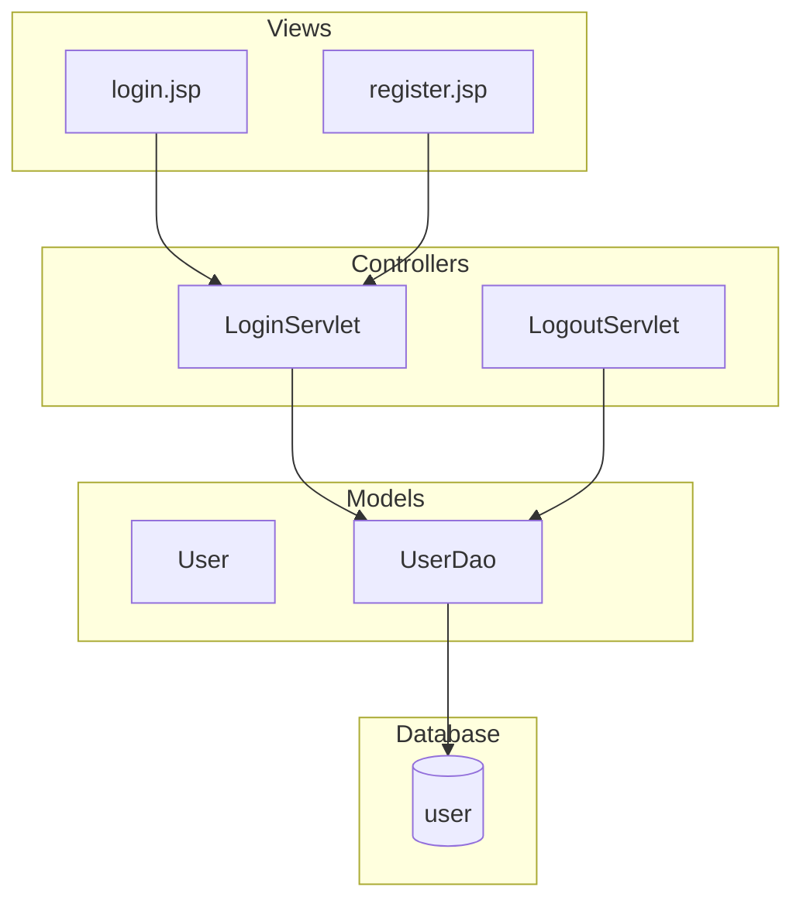
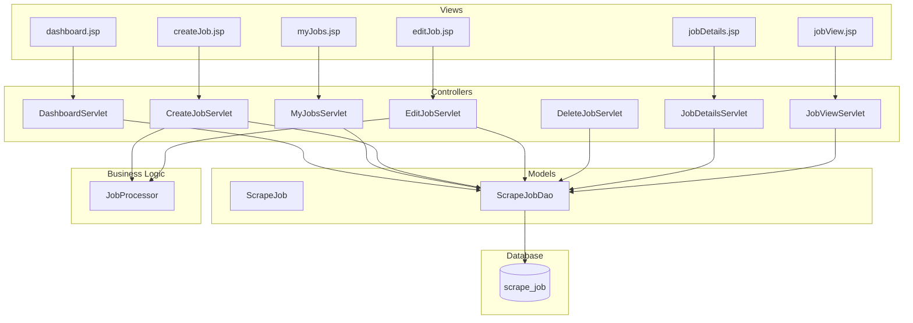
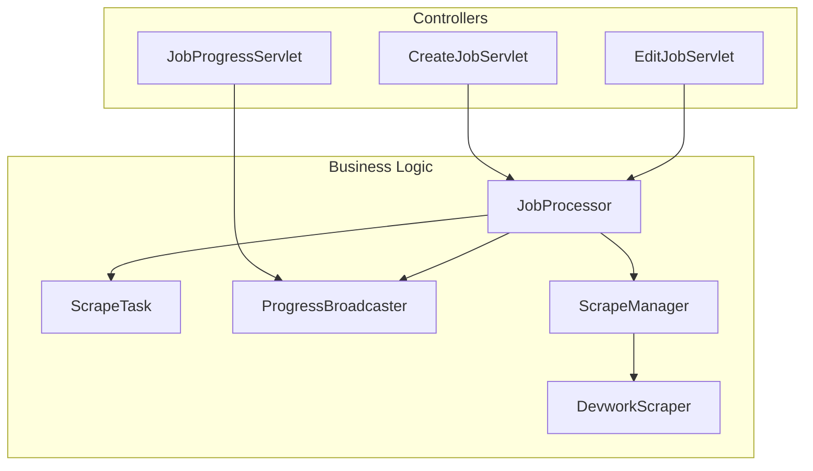
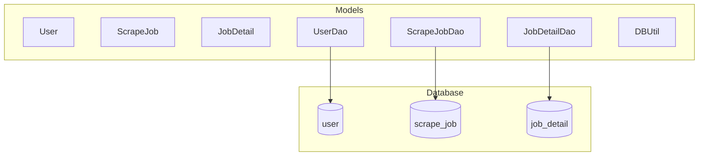
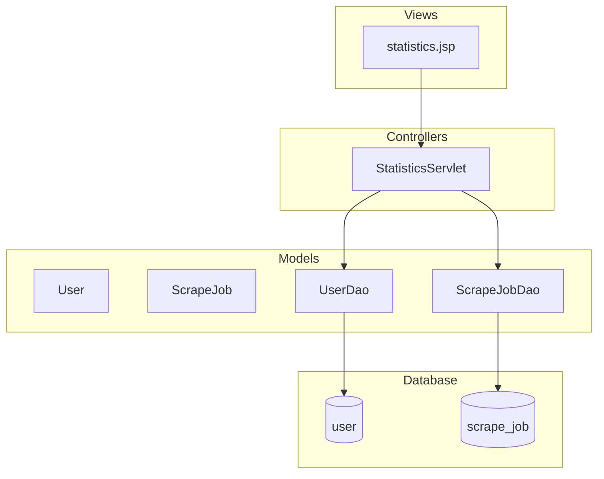

# Ứng dụng Thu thập Việc làm Devwork

Một ứng dụng Java Servlet full-stack thu thập thông tin việc làm từ Devwork.vn, lưu trữ trong MySQL và cung cấp giao diện web để người dùng quản lý các công việc thu thập dữ liệu.

## Tính năng

- Xác thực người dùng (đăng nhập/đăng ký/đăng xuất)
- Bảng điều khiển để xem lịch sử công việc thu thập
- Quản lý công việc cá nhân (xem, tạo, chỉnh sửa, xóa công việc thu thập)
- Tạo công việc thu thập mới với nhiều URL
- Xử lý công việc theo hàng đợi với việc thu thập nền
- Theo dõi tiến độ công việc thu thập theo thời gian thực (SSE)
- Hiển thị chi tiết công việc đã thu thập với kỹ năng, mô tả và thông tin công ty
- Thống kê quản trị (cho người dùng admin)
- Giao diện web đáp ứng với chế độ xem chi tiết công việc rõ ràng
- Hỗ trợ đa ngôn ngữ (tiếng Việt) với mã hóa UTF-8

## Kiến trúc

Ứng dụng này tuân theo kiến trúc MVC (Model-View-Controller) gồm có các thành phần sau:

- **Model**: Các lớp Java đại diện cho dữ liệu (User, ScrapeJob, JobDetail) và DAO để thao tác cơ sở dữ liệu (UserDao, ScrapeJobDao, JobDetailDao)
- **View**: Các trang JSP cho giao diện người dùng (index.jsp, login.jsp, register.jsp, dashboard.jsp, myJobs.jsp, createJob.jsp, editJob.jsp, jobDetails.jsp, jobView.jsp, statistics.jsp)
- **Controller**: Các Servlet xử lý yêu cầu và phản hồi HTTP (LoginServlet, DashboardServlet, MyJobsServlet, CreateJobServlet, EditJobServlet, DeleteJobServlet, JobDetailsServlet, StatisticsServlet, v.v.)
- **Scraper**: Bộ thu thập web dựa trên Jsoup cho Devwork.vn (DevworkScraper, ScrapeManager)
- **Job Processor**: Hệ thống hàng đợi nền để xử lý các tác vụ thu thập (JobProcessor, ScrapeTask, ProgressBroadcaster)
- **Database**: MySQL với mã hóa UTF-8 để lưu trữ người dùng, công việc và dữ liệu đã thu thập (user, scrape_job, job_detail)

### 1. Luồng Xác thực (Authentication Flow)

Sơ đồ này minh họa luồng xác thực người dùng trong ứng dụng. Người dùng tương tác với các trang JSP (login.jsp và register.jsp) để đăng nhập hoặc đăng ký. Các yêu cầu này được xử lý bởi LoginServlet và LogoutServlet, sau đó tương tác với UserDao để truy cập cơ sở dữ liệu user để xác thực hoặc lưu trữ thông tin người dùng.



### 2. Luồng Quản lý Công việc (Job Management Flow)

Sơ đồ này mô tả luồng quản lý công việc thu thập dữ liệu. Các trang JSP như dashboard, myJobs, createJob, editJob, jobDetails và jobView tương tác với các Servlet tương ứng để xử lý các thao tác CRUD (tạo, đọc, cập nhật, xóa) trên công việc thu thập. Các Servlet này sử dụng ScrapeJobDao để truy cập bảng scrape_job trong cơ sở dữ liệu, và một số Servlet kích hoạt JobProcessor để xử lý logic nghiệp vụ.



### 3. Luồng Xử lý Công việc (Job Processing Flow)

Sơ đồ này tập trung vào quy trình xử lý công việc thu thập nền. Khi tạo hoặc chỉnh sửa công việc, CreateJobServlet và EditJobServlet kích hoạt JobProcessor. JobProcessor quản lý ScrapeTask để thực hiện thu thập, sử dụng ScrapeManager và DevworkScraper để thu thập dữ liệu từ Devwork.vn. ProgressBroadcaster được sử dụng bởi JobProgressServlet để gửi cập nhật tiến độ theo thời gian thực qua Server-Sent Events.



### 4. Luồng Truy cập Dữ liệu (Data Access Flow)

Sơ đồ này minh họa cách các lớp mô hình dữ liệu tương tác với cơ sở dữ liệu. Các bean (User, ScrapeJob, JobDetail) được thao tác thông qua các DAO tương ứng (UserDao, ScrapeJobDao, JobDetailDao), sử dụng DBUtil để quản lý kết nối cơ sở dữ liệu. Mỗi DAO tương tác với một bảng cụ thể: user, scrape_job và job_detail.



### 5. Luồng Tính năng Admin (Admin Features Flow)

Sơ đồ này mô tả luồng tính năng quản trị dành cho người dùng admin. Trang statistics.jsp gửi yêu cầu đến StatisticsServlet, servlet này truy vấn UserDao và ScrapeJobDao để lấy dữ liệu thống kê từ các bảng user và scrape_job trong cơ sở dữ liệu, sau đó hiển thị thông tin tổng quan về hệ thống.



## Yêu cầu tiên quyết

- Java JDK 11 hoặc cao hơn
- Apache Maven 3.6+
- Apache Tomcat 9+ (Windows)
- MySQL 8.0+ (qua XAMPP)
- Hệ điều hành Windows

## Cài đặt và Triển khai

### 1. Cài đặt Java JDK

1. Tải JDK từ [Oracle](https://www.oracle.com/java/technologies/javase-jdk11-downloads.html).
2. Cài đặt vào vị trí mặc định (ví dụ: `C:\Program Files\Java\jdk-11.x.x`)
3. Thêm `%JAVA_HOME%\bin` vào PATH (JAVA_HOME là tùy chọn nhưng được khuyến nghị cho một số công cụ phát triển)

### 2. Cài đặt Apache Maven

1. Tải Maven từ [maven.apache.org](https://maven.apache.org/download.cgi)
2. Giải nén vào `C:\Program Files\Apache\maven-3.x.x`
3. Thêm `%MAVEN_HOME%\bin` vào PATH (MAVEN_HOME là tùy chọn nhưng được khuyến nghị cho một số công cụ phát triển)
4. Xác minh: Mở command prompt và chạy `mvn -version`

### 3. Cài đặt XAMPP (MySQL)

1. Tải XAMPP từ [apachefriends.org](https://www.apachefriends.org/download.html)
2. Cài đặt vào vị trí mặc định (thường là `C:\xampp`)
3. Khởi động XAMPP Control Panel
4. Khởi động dịch vụ MySQL
5. Mở phpMyAdmin (<http://localhost/phpmyadmin>)
6. Tạo cơ sở dữ liệu: `ltm` với collation `utf8mb4_vietnamese_ci`

### 4. Cài đặt Apache Tomcat

1. Tải Tomcat 9 từ [tomcat.apache.org](https://tomcat.apache.org/download-90.cgi)
2. Giải nén vào `C:\Program Files\Apache\Tomcat 9.x`
3. Thiết lập biến môi trường:
   - `CATALINA_HOME = C:\Program Files\Apache\Tomcat 9.x`
4. Khởi động Tomcat: Chạy `%CATALINA_HOME%\bin\startup.bat`

### 5. Thiết lập Cơ sở dữ liệu

1. Trong phpMyAdmin, tạo cơ sở dữ liệu `ltm` với collation `utf8mb4_vietnamese_ci`
2. Chạy script SQL từ `schema.sql` trong thư mục gốc dự án

### 6. Xây dựng và Triển khai Ứng dụng

1. Clone hoặc tải về dự án
2. Mở command prompt trong thư mục gốc dự án
3. Xây dựng dự án:

   ```
   mvn clean package
   ```

4. Triển khai file WAR:
   - Sao chép `target\app.war` vào `%CATALINA_HOME%\webapps\`
   - Hoặc sử dụng Tomcat Manager (<http://localhost:8080/manager/html>)
5. Truy cập ứng dụng tại: <http://localhost:8080/app/>

## Hướng dẫn sử dụng

### Đăng ký và Đăng nhập

#### Đăng ký tài khoản mới

- Truy cập trang đăng nhập tại <http://localhost:8080/app/login>
- Nhấp vào liên kết "Đăng ký" nếu chưa có tài khoản
- Điền thông tin:
  - Tên đăng nhập (username)
  - Mật khẩu (password)
  - Xác nhận mật khẩu
- Nhấp "Đăng ký" để tạo tài khoản
- Sau khi đăng ký thành công, bạn sẽ được chuyển hướng đến trang đăng nhập

#### Đăng nhập

- Truy cập <http://localhost:8080/app/login>
- Nhập tên đăng nhập và mật khẩu
- Nhấp "Đăng nhập"
- Sau khi đăng nhập thành công, bạn sẽ được chuyển hướng đến trang chủ

### Trang chủ (Danh sách công việc)

- Sau khi đăng nhập, bạn sẽ thấy trang chủ hiển thị danh sách các công việc việc làm đã được thu thập
- Mỗi công việc hiển thị:
  - Tiêu đề công việc
  - Tên công ty
  - Tỉnh/thành phố
  - Mức lương
  - Ngày thu thập
  - Hình thu nhỏ (nếu có)
- Sử dụng hộp tìm kiếm để lọc công việc theo từ khóa
- Nhấp vào tiêu đề công việc để xem chi tiết

### Bảng điều khiển (Dashboard)

- Truy cập bảng điều khiển từ thanh điều hướng
- Xem tổng quan:
  - Số lượng công việc đã thu thập
  - Trạng thái các công việc thu thập gần đây
  - Thống kê cơ bản

### Quản lý công việc thu thập cá nhân

#### Xem công việc của tôi

- Nhấp "Công việc của tôi" trong thanh điều hướng
- Xem danh sách các công việc thu thập bạn đã tạo
- Mỗi công việc hiển thị:
  - Tên công việc
  - Trạng thái (Đang xử lý, Hoàn thành, Lỗi)
  - Ngày tạo
  - Số URL đã nhập

#### Tạo công việc thu thập mới

- Nhấp "Tạo công việc" từ trang "Công việc của tôi"
- Điền thông tin:
  - Tên công việc (ví dụ: "Thu thập IT jobs Hà Nội")
  - Danh sách URL (mỗi URL trên một dòng)
  - URL phải là trang công việc từ Devwork.vn
- Nhấp "Tạo công việc"
- Công việc sẽ được thêm vào hàng đợi xử lý

#### Chỉnh sửa công việc

- Từ trang "Công việc của tôi", nhấp "Chỉnh sửa" bên cạnh công việc
- Cập nhật tên công việc hoặc danh sách URL
- Nhấp "Lưu thay đổi"

#### Xóa công việc

- Từ trang "Công việc của tôi", nhấp "Xóa" bên cạnh công việc
- Xác nhận xóa trong hộp thoại

### Theo dõi tiến độ thu thập

- Sau khi tạo công việc, nhấp vào tên công việc để xem chi tiết
- Trang chi tiết hiển thị:
  - Thông tin công việc thu thập
  - Danh sách URL đang được xử lý
  - Thanh tiến độ theo thời gian thực
  - Trạng thái từng URL (Đang thu thập, Hoàn thành, Lỗi)
- Tiến độ được cập nhật tự động qua Server-Sent Events (SSE)

### Xem kết quả thu thập

- Khi công việc hoàn thành, nhấp vào "Xem kết quả" từ trang chi tiết công việc
- Xem danh sách các công việc đã thu thập được:
  - Tiêu đề công việc
  - Tên công ty và liên kết
  - Tỉnh/thành phố
  - Mức lương
  - Ngày thu thập
- Nhấp vào tiêu đề để xem chi tiết từng công việc

### Chi tiết công việc

- Trang chi tiết hiển thị thông tin đầy đủ:
  - Tiêu đề và thông tin cơ bản
  - Mô tả công việc (có thể có nhiều phần)
  - Kỹ năng yêu cầu (hiển thị dưới dạng thẻ)
  - Thông tin bổ sung (địa điểm, kinh nghiệm, v.v.)
  - Hình thu nhỏ công ty (nếu có)
  - Liên kết đến trang gốc
- Sử dụng nút "Quay lại" để trở về danh sách

### Thống kê hệ thống (Chỉ dành cho Admin)

- Người dùng có quyền admin có thể truy cập trang thống kê
- Xem:
  - Tổng số người dùng
  - Tổng số công việc thu thập
  - Tổng số công việc đã thu thập được
  - Thống kê theo thời gian
- Dữ liệu được cập nhật theo thời gian thực

### Đăng xuất

- Nhấp "Đăng xuất" trong thanh điều hướng
- Bạn sẽ được chuyển hướng về trang đăng nhập

### Lưu ý quan trọng

- Đảm bảo URL nhập vào là trang công việc hợp lệ từ Devwork.vn
- Quá trình thu thập có thể mất thời gian tùy thuộc vào số lượng URL
- Theo dõi tiến độ để biết trạng thái công việc
- Dữ liệu thu thập được lưu trữ vĩnh viễn trong cơ sở dữ liệu
- Chỉ admin mới có quyền xem thống kê hệ thống

## Công nghệ được sử dụng

- **Backend**: Java Servlets (Jakarta EE 6.1.0), Maven
- **Frontend**: JSP, HTML, CSS
- **Database**: MySQL 8.0 với hỗ trợ UTF-8
- **Scraping**: Jsoup 1.17.1
- **JSON Processing**: Gson 2.10.1
- **Web Server**: Apache Tomcat 9
- **Development**: Java 11, Maven

## Cấu trúc dự án

```
project-root/
├── src/
│   └── app/
│       ├── controller/     # Bộ điều khiển HTTP (Servlets)
│       ├── model/
│       │   ├── bean/       # Các lớp mô hình dữ liệu (User, ScrapeJob, JobDetail)
│       │   ├── bo/         # Đối tượng nghiệp vụ
│       │   └── dao/        # Đối tượng truy cập dữ liệu (UserDao, ScrapeJobDao, JobDetailDao, DBUtil)
│       ├── scraper/        # Logic thu thập web (DevworkScraper, ScrapeManager)
│       └── util/           # Tiện ích (JobProcessor, ScrapeTask, ProgressBroadcaster)
├── webapp/                 # Views JSP và tài nguyên web
│   ├── *.jsp               # Mẫu views
│   └── WEB-INF/
├── target/                 # Đầu ra build
├── schema.sql              # Lược đồ cơ sở dữ liệu
├── deprecated_sql/         # Các file SQL đã lỗi thời (giữ để tham khảo)
├── pom.xml                 # Cấu hình Maven
└── README.md               # File hiện tại mà bạn đang đọc
```

## Khắc phục sự cố

- **Xung đột cổng**: Đảm bảo các cổng Tomcat (8080) và MySQL (3306) không bị chiếm
- **Vấn đề mã hóa**: Cơ sở dữ liệu phải sử dụng collation UTF-8 cho văn bản tiếng Việt
- **Lỗi thu thập**: Kiểm tra URL có phải là trang công việc Devwork hợp lệ
- **Lỗi build**: Đảm bảo Java và Maven đã được thêm vào PATH. Nếu gặp vấn đề với một số IDE hoặc công cụ, hãy thiết lập JAVA_HOME và MAVEN_HOME
