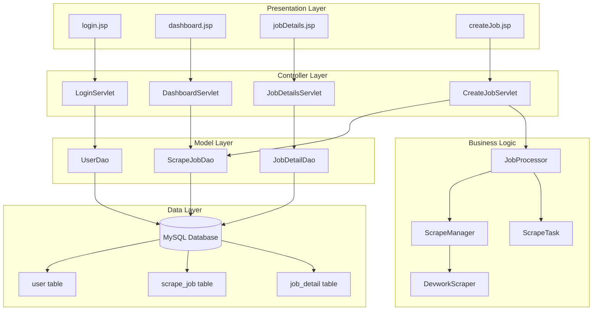

# Devwork Job Scraper

A full-stack Java Servlet application that scrapes job listings from Devwork.vn, stores them in MySQL, and provides a web interface for users to manage scraping jobs.

## Features

- User authentication (login/register)
- Dashboard to view scraping job history
- Create new scraping jobs with multiple URLs
- Queue-based job processing with background scraping
- Display scraped job details with skills, descriptions, and company info
- Responsive web interface with clean job detail views

## Architecture

This application follows the MVC (Model-View-Controller) architecture:



### Components

- **Model**: Java classes representing data (User, ScrapeJob, JobDetail) and DAOs for database operations
- **View**: JSP pages for the user interface
- **Controller**: Servlets handling HTTP requests and responses
- **Scraper**: Jsoup-based web scraper for Devwork.vn
- **Job Processor**: Background queue system for processing scraping tasks
- **Database**: MySQL with UTF-8 encoding for storing users, jobs, and scraped data

## Prerequisites

- Java JDK 11 or higher
- Apache Maven 3.6+
- Apache Tomcat 9+ (Windows)
- MySQL 8.0+ (via XAMPP)
- Windows operating system

## Installation and Deployment

### 1. Install Java JDK

1. Download JDK from [Oracle](https://www.oracle.com/java/technologies/javase-jdk11-downloads.html) or [AdoptOpenJDK](https://adoptopenjdk.net/)
2. Install to default location (e.g., `C:\Program Files\Java\jdk-11.x.x`)
3. Set environment variables:
   - `JAVA_HOME = C:\Program Files\Java\jdk-11.x.x`
   - Add `%JAVA_HOME%\bin` to PATH

### 2. Install Apache Maven

1. Download Maven from [maven.apache.org](https://maven.apache.org/download.cgi)
2. Extract to `C:\Program Files\Apache\maven-3.x.x`
3. Set environment variables:
   - `MAVEN_HOME = C:\Program Files\Apache\maven-3.x.x`
   - Add `%MAVEN_HOME%\bin` to PATH
4. Verify: Open command prompt and run `mvn -version`

### 3. Install XAMPP (MySQL)

1. Download XAMPP from [apachefriends.org](https://www.apachefriends.org/download.html)
2. Install to default location (usually `C:\xampp`)
3. Start XAMPP Control Panel
4. Start MySQL service
5. Open phpMyAdmin (<http://localhost/phpmyadmin>)
6. Create database: `ltm` with collation `utf8mb4_vietnamese_ci`

### 4. Install Apache Tomcat

1. Download Tomcat 9 from [tomcat.apache.org](https://tomcat.apache.org/download-90.cgi)
2. Extract to `C:\Program Files\Apache\Tomcat 9.x`
3. Set environment variables:
   - `CATALINA_HOME = C:\Program Files\Apache\Tomcat 9.x`
4. Start Tomcat: Run `%CATALINA_HOME%\bin\startup.bat`

### 5. Setup Database

1. In phpMyAdmin, create database `ltm` with `utf8mb4_vietnamese_ci` collation
2. Run the SQL script from `schema.sql` in your project root

### 6. Build and Deploy the Application

1. Clone or download the project
2. Open command prompt in project root
3. Build the project:

   ```
   mvn clean package
   ```

4. Deploy the WAR file:
   - Copy `target\app.war` to `%CATALINA_HOME%\webapps\`
   - Or use Tomcat Manager (<http://localhost:8080/manager/html>)
5. Access the application at: <http://localhost:8080/app/>

## Usage

1. **Register/Login**: Create an account or login
2. **Dashboard**: View your scraping job history
3. **Create Job**: Enter Devwork job URLs (one per line) to scrape
4. **View Results**: Click on completed jobs to see detailed job information
5. **Job Details**: View job title, company, salary, skills (as tags), descriptions, and additional info

## Technologies Used

- **Backend**: Java Servlets (Jakarta EE 6.1.0), Maven
- **Frontend**: JSP, HTML, CSS
- **Database**: MySQL 8.0 with UTF-8 support
- **Scraping**: Jsoup 1.17.1
- **JSON Processing**: Gson 2.10.1
- **Web Server**: Apache Tomcat 9
- **Development**: Java 11, Maven

## Project Structure

```
project-root/
├── src/
│   └── app/
│       ├── dao/           # Data Access Objects
│       ├── model/         # Data models
│       ├── scraper/       # Web scraping logic
│       ├── servlet/       # HTTP controllers
│       └── util/          # Utilities (JobProcessor, etc.)
├── webapp/                # JSP views and web resources
├── schema.sql             # Database schema
├── deprecated_sql/        # Deprecated SQL files (kept for reference only)
├── pom.xml               # Maven configuration
└── README.md             # This file
```

## Troubleshooting

- **Port conflicts**: Ensure Tomcat (8080) and MySQL (3306) ports are free
- **Encoding issues**: Database must use UTF-8 collation for Vietnamese text
- **Scraping failures**: Check URLs are valid Devwork job pages
- **Build errors**: Ensure JAVA_HOME and MAVEN_HOME are set correctly

## License

This project is for educational purposes.

